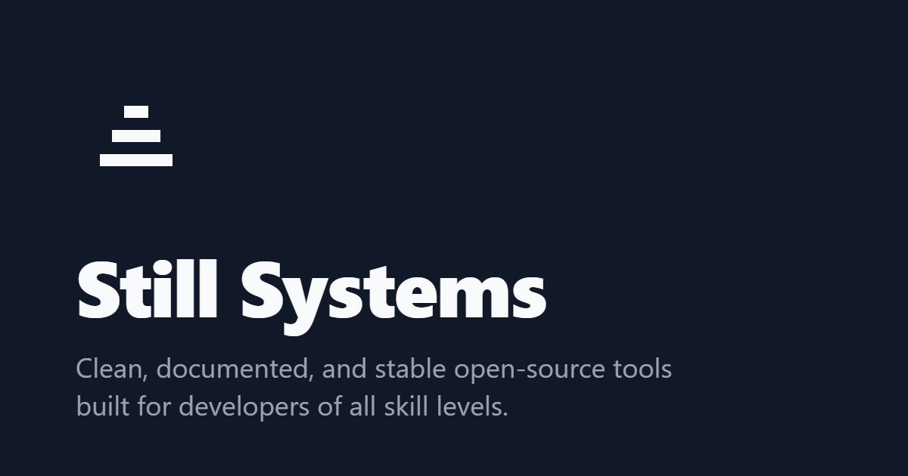

<picture>
  <source media="(prefers-color-scheme: dark)" srcset="../brand/social-preview-dark.png">
  <source media="(prefers-color-scheme: light)" srcset="../brand/social-preview-light.png">
  
</picture>

---

## Mission
Still Systems is a focused workshop dedicated to building foundational developer tools. We prioritize structural clarity, long-term stability, and beginner-friendly documentation over feature bloat and trend-chasing. 

Our goal is to provide software that "just works"—allowing you to focus on your build rather than troubleshooting your tools.

## The Workshop
We specialize in building lightweight, high-utility systems and ensuring they are accessible across all major development environments.

### Flagship: Nexus-V
The core engine of the Still Systems ecosystem. 
[View Repository](https://github.com/stillsystems/nexus-v)

### Distribution Channels
We maintain official, first-party support for the following package managers:
* **WinGet:** [winget-nexusv](https://github.com/stillsystems/winget-nexusv)
* **Scoop:** [scoop-bucket](https://github.com/stillsystems/scoop-bucket)
* **Homebrew:** [homebrew-nexusv](https://github.com/stillsystems/homebrew-nexusv)

## Getting Started
* **Explore:** Check our pinned repositories below for flagship tools and templates.
* **Contribute:** We welcome contributors of all experience levels. Please read our [Contributing Guidelines](../CONTRIBUTING.md) to understand our workflow.
* **Support:** If you encounter a bug or need help, open an issue in the relevant repository or check our [Support Page](../SUPPORT.md).

## How We Work
* **Consistency:** Every tool follows the same documentation structure and coding standards.
* **Stability:** We prioritize backward compatibility and stable releases.
* **Transparency:** Our development roadmap and decision-making processes are public.

---

[Documentation](https://stillsystems.github.io) • [Security](../SECURITY.md) • [Conduct](../CODE_OF_CONDUCT.md)

*Athens, Texas*
