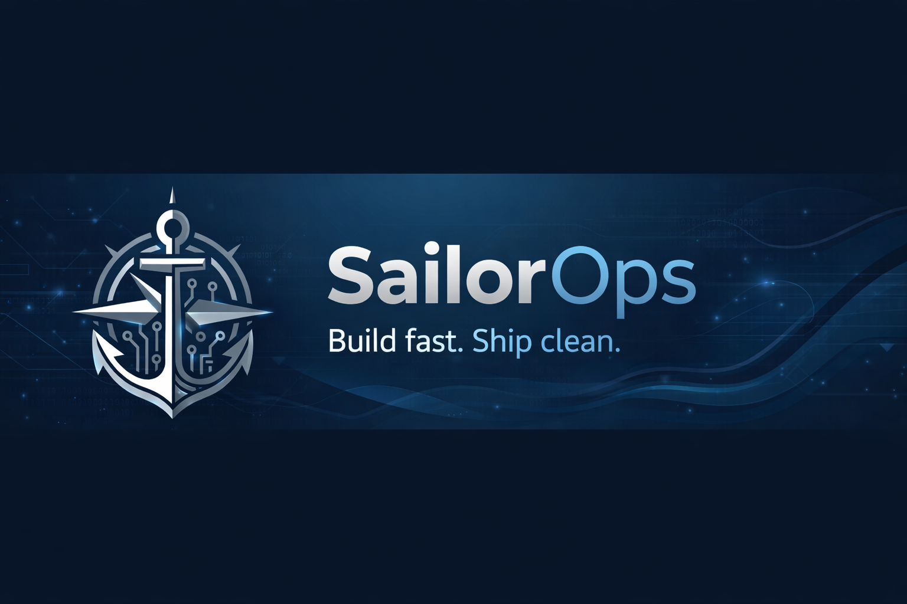

# ⚓ SailorOps

**Modern developer tooling engineered for real‑world conditions.**  
Build fast. Ship clean.

SailorOps creates zero‑install, dependency‑light tools that eliminate friction, reduce hidden state, and give developers operational clarity. Every project in this organization follows the same philosophy: **portable, predictable, and built for long‑term maintainability.**

---

## 🚀 What We Build

### **Zero‑Install Tooling**
Portable binaries, no global installs, no PATH pollution, no ecosystem rot.

### **Developer‑First Workflows**
Tools that anticipate needs, reveal hidden friction, and stay out of your way.

### **Operational Discipline**
Inspired by real‑world engineering and military‑grade reliability — clean, minimal, and intentional.

---

## 🧰 Featured Project

### **[NEXUS‑V](https://github.com/SailorOps/Nexus-V)**  

*A modern, zero‑install VS Code extension scaffolder — built in Go, outputs TypeScript.*

NEXUS‑V replaces the legacy Yeoman `yo code` generator with a single static binary that produces clean, modern VS Code extension projects. It is the first flagship tool under the SailorOps umbrella.

---

## 🧭 Philosophy

SailorOps tools follow three principles:

- 🛡️ **Clarity over cleverness** — predictable behavior, no magic.  
- 📦 **Portability over complexity** — single binaries, no global state.  
- ⚓ **Durability over trends** — long‑term maintainability, minimal dependencies.

If a tool adds friction, hides state, or requires a dependency tree to understand, it doesn’t belong here.

---

## 📦 Projects & Ecosystem

| Project | Description | Status |
|:---|:---|:---|
| **[NEXUS‑V](https://github.com/SailorOps/Nexus-V)** | Zero‑install VS Code extension scaffolder | 🚀 Active |
| **[Scoop Bucket](https://github.com/SailorOps/scoop-bucket)** | Windows distribution for SailorOps tools | 🚧 In progress |
| **[Homebrew Tap](https://github.com/SailorOps/homebrew-tap)** | macOS/Linux distribution for SailorOps tools | 🚀 Active |
| **[Winget Package](https://github.com/SailorOps/winget-pkgs)** | Windows package distribution | 🚀 Active |
| **Template Library** | Community‑driven extension templates | 🧪 Experimental |

---

## 🗺️ Roadmap

- **Monorepo tooling** for multi‑extension VS Code projects  
- **Template discovery service** for community‑authored NEXUS‑V plugins  
- **Meta‑extension**: a VS Code UI wrapper for NEXUS‑V  
- **Portable developer utilities** aligned with the SailorOps philosophy  

---

## 🤝 Contributing

SailorOps welcomes contributions from developers who value:
- clean, maintainable code  
- minimal dependencies  
- predictable behavior  
- thoughtful tooling design  

If that sounds like you, jump in.

---

## 📬 Contact

Have ideas, feedback, or templates to share?  
Open an issue in any [SailorOps repository](https://github.com/orgs/SailorOps/repositories) — we read everything.
